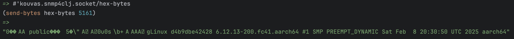

Work In Progress...

*Proof Of Concept*

Let's compare it against the great [SNMP4J](https://www.snmp4j.org/) java lib

The SNMP4J Get request:

```
Target:
CommunityTarget[address=127.0.0.1/5161,version=1,timeout=1500,retries=2,securityLevel=1,securityModel=1,securityName=public,preferredTransports=null]
PDU request:
GET[requestID=0, errorStatus=Success(0), errorIndex=0, VBS[1.3.6.1.2.1.1.1.0 = Null]]
Request timed out

```

Captured hex bytes sent over the wire with netcat(3 consecutive retries)

```
❯ nc -u -l 5161 | hexdump -C
00000000  30 29 02 01 01 04 06 70  75 62 6c 69 63 a0 1c 02  |0).....public...|
00000010  04 30 e2 5b 74 02 01 00  02 01 00 30 0e 30 0c 06  |.0.[t......0.0..|
00000020  08 2b 06 01 02 01 01 01  00 05 00 30 29 02 01 01  |.+.........0)...|
00000030  04 06 70 75 62 6c 69 63  a0 1c 02 04 30 e2 5b 74  |..public....0.[t|
00000040  02 01 00 02 01 00 30 0e  30 0c 06 08 2b 06 01 02  |......0.0...+...|
00000050  01 01 01 00 05 00 30 29  02 01 01 04 06 70 75 62  |......0).....pub|
00000060  6c 69 63 a0 1c 02 04 30  e2 5b 74 02 01 00 02 01  |lic....0.[t.....|
00000070  00 30 0e 30 0c 06 08 2b  06 01 02 01 01 01 00 05  |.0.0...+........|

00000080  00                                                |.|
00000081

~ took 26s 
❯ 
```

Close netcat and launch Alpine Linux container with `snmpd` and retry SNMP4J request:

```
Target:
CommunityTarget[address=127.0.0.1/5161,version=1,timeout=1500,retries=2,securityLevel=1,securityModel=1,securityName=public,preferredTransports=null]
PDU request:
GET[requestID=0, errorStatus=Success(0), errorIndex=0, VBS[1.3.6.1.2.1.1.1.0 = Null]]

Response:
[1.3.6.1.2.1.1.1.0 = Linux d4b9dbe42428 6.12.13-200.fc41.aarch64 #1 SMP PREEMPT_DYNAMIC Sat Feb  8 20:30:50 UTC 2025 aarch64]

Duration(ms): 7
```

Now let's try sending the same hex bytes to linux container using this Clojure UDP socket:

```clojure 
;nREPL server started on port 52031 on host localhost - nrepl://localhost:52031
(in-ns 'kouvas.snmp4clj.socket)
;=> #object[clojure.lang.Namespace 0x7266e161 "kouvas.snmp4clj.socket"]
;Loading src/kouvas/snmp4clj/socket.clj... done
;Loading src/kouvas/snmp4clj/socket.clj... done
(defn send-bytes
  [bytes-array port]
  (with-open [socket (doto (create)
                       (timeout! 5000))]
    (let [address     (InetAddress/getLocalHost)
          send-packet (packet/create bytes-array address port)]

      (send socket send-packet)

      (let [receive-buffer (byte-array 1024)
            receive-packet (packet/create receive-buffer address port)]
        (try
          (receive socket receive-packet)
          (String. receive-buffer 0 (packet/length receive-packet))
          (catch java.net.SocketTimeoutException _
            (println "No response from server")
            nil))))))
;=> #'kouvas.snmp4clj.socket/send-bytes
(def hex-bytes (byte-array
                 [0x30 0x29                               ; SEQUENCE, length 41 bytes (SNMP message)
                  0x02 0x01 0x01                          ; INTEGER 1 (SNMP version - SNMPv2c)
                  0x04 0x06 0x70 0x75 0x62 0x6c 0x69 0x63 ; OCTET STRING "public" (community string)
                  0xa0 0x1c                               ; GetRequest PDU, length 28 bytes
                  0x02 0x04 0x0b 0x35 0xf2 0x22           ; INTEGER request-id (0x0b35f222 = 188019234)
                  0x02 0x01 0x00                          ; INTEGER error-status (0 = no error)
                  0x02 0x01 0x00                          ; INTEGER error-index (0)
                  0x30 0x0e                               ; SEQUENCE varbind list, length 14
                  0x30 0x0c                               ; SEQUENCE varbind, length 12
                  0x06 0x08 0x2b 0x06 0x01 0x02 0x01 0x01 0x01 0x00 ; OID 1.3.6.1.2.1.1.1.0 (sysDescr.0)
                  0x05 0x00                               ; NULL (for GetRequest)
                  ]))
;=> #'kouvas.snmp4clj.socket/hex-bytes
```


And it works! The first part of the reply is gibberish because we don't use BER decoding on received bytes yet. (it's
also breaking github's markdown rendering if included as text)

## What's next?

- SNMP version 1 and 2c over UDP full support
